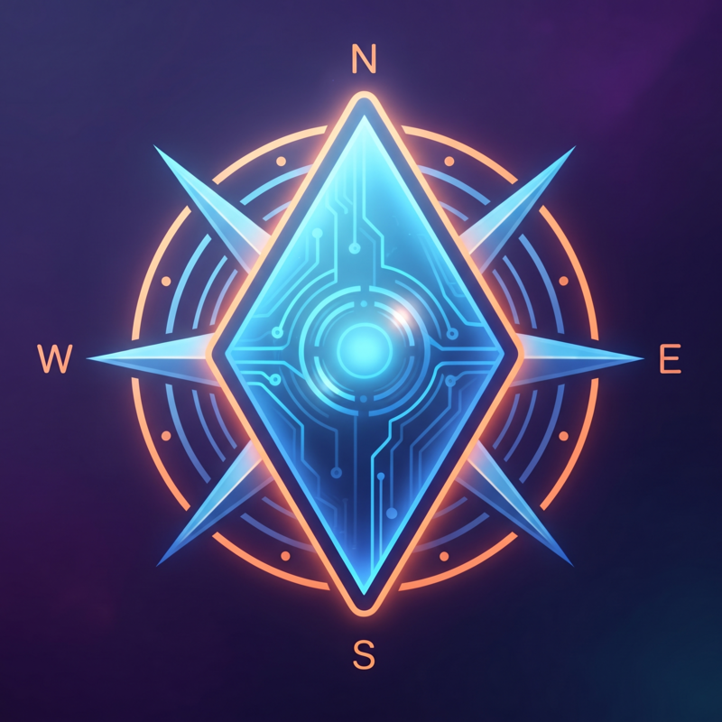
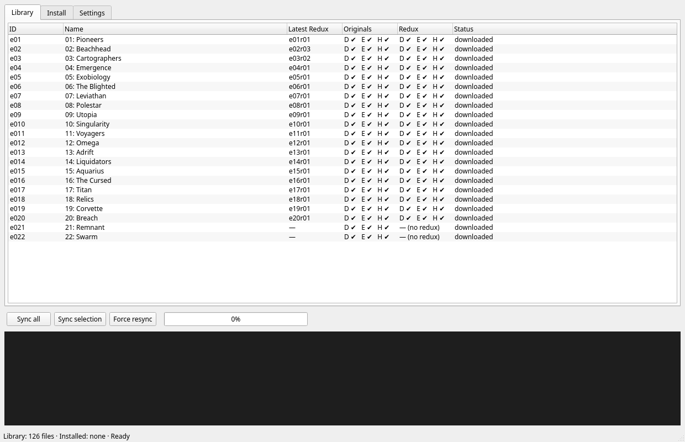
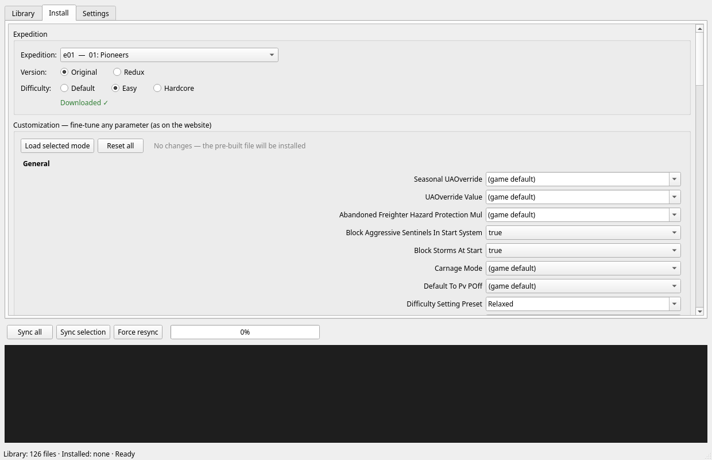
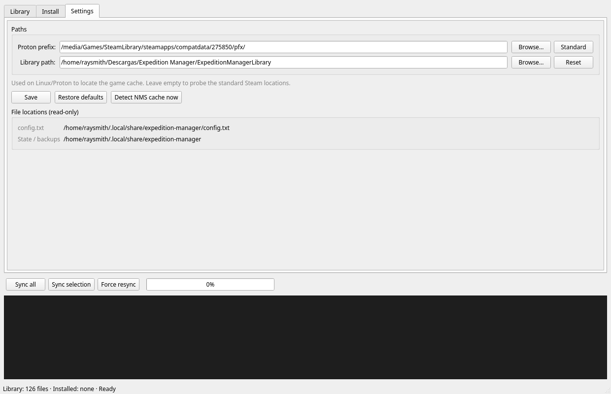

# NMS Expedition Manager

<p align="center">
  
</p>

Offline expedition manager for **No Man's Sky** (PC/Mac/Steam Deck/Linux),
based on the files from [cwmonkey/nms-expeditions](https://cwmonkey.github.io/nms-expeditions/).

<p align="center">
  <a href="https://ko-fi.com/nikatakahashi" target="_blank">
    
  </a>
</p>

> **Enjoying this?** If Expedition Manager saves you time or hassle, you can
> buy me a coffee: **[ko-fi.com/nikatakahashi](https://ko-fi.com/nikatakahashi)**. It's
> the best way to keep the project alive. Thank you! 🚀

## Screenshots

*Library* — the full catalog with per-expedition sync and install status:

<p align="center"></p>

*Install* — version, difficulty and the 67-parameter customization form:

<p align="center"></p>

*Settings* — game paths, state and file locations:

<p align="center"></p>

## Usage

**Linux / macOS** (the GUI works exactly the same on both; on macOS you
can also double-click `run-gui.command` in Finder):

```bash
cd "Expedition Manager"
./run.sh            # interactive menu (creates the venv automatically the first time)
./run.sh gui        # graphical interface (all-in-one: sync, install, settings)
./run-gui.sh        # same thing: dedicated one-command GUI launcher
```

**Windows** (needs Python 3 with Tk — included in the python.org installer;
check *"Add python to PATH"*):

```bat
cd "Expedition Manager"
run.bat             # interactive menu (creates the .venv automatically the first time)
run-gui.bat         # graphical interface
```

Or just double-click **`run-gui.bat`** in Explorer.

Or CLI mode:

```bash
./run.sh sync                # downloads/synchronizes all expeditions
./run.sh install             # install (asks for expedition, original/redux, difficulty)
./run.sh install --exp e01 --mode redux --difficulty easy
./run.sh install --exp e01 --mode original --difficulty hardcore
./run.sh uninstall           # restore the original cache
./run.sh list                # library + installation + config
./run.sh config              # edit config (library, Proton prefix path)
```

## Library layout

```
<program directory>/ExpeditionManagerLibrary/
├── Originals/{Defaults,Easy,Hardcore}/<NN_Name>/SEASON_DATA_CACHE_S22.JSON + INSTRUCTIONS.md
└── Redux/{Defaults,Easy,Hardcore}/<NN_Name>/...
```

- **Originals**: the original (r00) version of each expedition.
- **Redux**: the latest redux version of each expedition.
- **Defaults**: the original parameters, unmodified.
- **Easy**: with the *Easy* preset applied (relaxed mode).
- **Hardcore**: with the *Hard Mode (Permadeath)* preset applied (full
  survival, permadeath, harsh economy) — the `customizations.hard_mode.json`
  preset from the website, applied through the same mechanism.

The generated files are byte-identical to the ones produced by the official
website (same patch order, same JS serialization, same credit line).

## Platforms

| OS | Where the game cache is found | Where state/backups live |
|---|---|---|
| Linux (Proton) | `<prefix>/drive_c/users/steamuser/AppData/Roaming/HelloGames/NMS/<steam id>/cache` | `~/.local/share/expedition-manager` |
| Windows | `%APPDATA%\HelloGames\NMS\<steam id>\cache` (also `DefaultUser` for MS Store/GOG) | `%LOCALAPPDATA%\expedition-manager` |
| macOS | `~/Library/Application Support/HelloGames/NMS/cache` | `~/Library/Application Support/expedition-manager` |

On Windows and macOS the game folder is probed automatically — run the game
once so it exists. On Linux, if your Steam library is not in the standard
location, set the prefix path with `./run.sh config` (the **default** option
uses `~/.steam/steam/steamapps/compatdata/275850/pfx`) or in the GUI
Settings tab.

## Personal overrides

Optional file `overrides.json` in the **per-user state directory** (see
*Configuration* below; on Linux: `~/.local/share/expedition-manager/`).
It holds personal adjustments applied at the very end of the generation
(after every patch), using the same language as the patches
(`[[removed]]`, `[[append]]`, ...). Keys are
`<exp_id>/<mode>/<difficulty>` (a filled-in example ships in the repo as
[`overrides.json.example`](overrides.json.example)):

```json
{
  "e03/Redux/Easy": { "BlockStormsAtStart": false },
  "e03/Originals/Easy": { "BlockStormsAtStart": "[[removed]]" }
}
```

## Configuration

The configuration is stored in `config.txt`, in the **per-user state
directory**:

| OS | State directory |
|---|---|
| Linux | `~/.local/share/expedition-manager/` |
| Windows | `%LOCALAPPDATA%\expedition-manager\` |
| macOS | `~/Library/Application Support/expedition-manager/` |

The file is created automatically the first time the program runs (with
default values) and you can edit it by hand or with `./run.sh config`.
Its format is documented in [`config.txt.example`](config.txt.example).
Files left in the program directory by older versions are migrated here
automatically on the first run.

## Guide: how to use the tool

### The typical workflow (same in GUI and CLI)

1. **Sync** — build/update the local library: every expedition × version ×
   difficulty is generated into `ExpeditionManagerLibrary/`.
2. **Install** — pick an expedition, a version and a difficulty. The
   program backs up the game's current cache file and replaces it with the
   chosen one.
3. **Play** — put Steam in **offline mode**, launch NMS, and start the
   expedition from the Anomaly terminal.
4. **Uninstall** — restore the original cache file (undoes the install).

Only **one expedition at a time**: the install-time backup is of whatever
file the game had at that moment. To switch between two expeditions, run
*uninstall* first — otherwise "restoring the original" would put back the
previously installed expedition, not the pristine cache.

### Command line

`./run.sh` with no arguments opens the interactive menu:

```
 1) Synchronize expeditions
 2) Install expedition
 3) Uninstall expedition
 4) List
 5) Configure
 6) Open graphical interface
 0) Quit
```

Option **2** walks you through the choices (numbered expedition list with
available redux, version `o`/`r`, difficulty `d`/`e`/`h`). Anything can
also be done as a one-shot command:

| Command | Options |
|---|---|
| `./run.sh sync` | `--force` re-downloads the sources and rewrites all 126 files · `--exp eNN` limits it to one expedition |
| `./run.sh install` | `--exp eNN`, `--mode original\|redux`, `--difficulty default\|easy\|hardcore` — omit any of them to be asked interactively. `--custom 'Prop=Value,…'` sets individual parameters (the website's form) on top of the difficulty |
| `./run.sh uninstall` | — (restores the original cache) |
| `./run.sh list` | — library contents (with INSTRUCTIONS check), current installation, config |
| `./run.sh config` | interactive: **1** Proton prefix (type `d` for the standard path), **2** library path, **0** done |
| `./run.sh gui` | — open the graphical interface |

Examples:

```bash
./run.sh sync --exp e05                          # only e05's files
./run.sh install --exp e05 --mode redux --difficulty easy
./run.sh install --exp e14 --mode original --difficulty hardcore
./run.sh install --exp e01 --difficulty easy --custom "CarnageMode=true,StartingSuitSlots=24"
./run.sh install                                 # fully guided
```

Notes:
- If the exact combination is not in the library yet, `install` tells you
to run `./run.sh sync` first (the GUI does this automatically with its
**Download first** button).
- An expedition without redux (e21) refuses `--mode redux`.
- If no NMS cache folder is found, the install stops and tells you to play
the game once (creates the prefix) or set the Proton prefix via
`./run.sh config`.

### Graphical interface

Start it with `./run.sh gui`, menu option **6)**, or the dedicated
launchers (`./run-gui.sh`, `run-gui.bat`, `run-gui.command`). The GUI is
built on **Qt6** (PyQt6 or
PySide6): on Linux it runs on **native Wayland (xdg-shell)** — no X11. The
Qt binding is reused from the system when available (Arch: `python-pyqt6`,
visible through the venv); otherwise `run.sh` installs PySide6 into the venv
automatically. If no Qt binding can be used at all, the GUI falls back to
the bundled tkinter implementation (X11). The CLI never needs a GUI toolkit
(it keeps working headless).

**Library tab** — one row per expedition:

| Column | Meaning |
|---|---|
| `ID` / `Name` | e01 … e22 and its name |
| `Latest Redux` | newest redux version id, or `—` when the expedition has none (e21) |
| `Originals` / `Redux` | three cells per version, `D` `E` `H`: ✔ when that Default/Easy/Hardcore file is in the library |
| `Status` | `not downloaded` / `downloaded` / `INSTALLED (mode/difficulty)` |

- **Double-click** a row → jumps to the Install tab with that expedition
  preselected.
- **Ctrl/Shift-click** several rows → *Sync selection* only syncs those.

**Sync strip** (bottom of the window, under the log) — *Sync all* / *Sync selection* /
*Force resync*, with a live progress bar (`n/126`) and the latest message.
A normal sync uses the local source cache and skips unchanged files
(sha256); *Force resync* re-downloads everything from GitHub — use it after
an upstream update or a new season (see *Season updates* below).

**Install tab**
1. **Expedition** combo (`eNN — name`).
2. **Version** — Original / Redux (the Redux button disables itself when
   the expedition has no redux).
3. **Difficulty** — Default / Easy / Hardcore. Changing it (or the
   expedition) reloads the customization form with that mode's values.
4. **Customization** (the website's form) — one dropdown per parameter
   (67 in total, grouped *General* and *Difficulty Minimums*):
   - dropdowns with fixed choices (survival, resources, faction, end
     date, …), `true`/`false` for toggles, free text for numbers and
     seeds; *`(game default)`* leaves the parameter untouched.
   - *Load selected mode* re-fills the form with the difficulty preset;
     *Reset all* puts everything back to `(game default)`.
   - Click a parameter to see its description (and ⚠ warnings) below.
   - The state line counts how many parameters differ from the mode: with
     **no** changes the pre-built library file is installed; with changes
     the file is **generated on the fly** from the cached sources (no
     network needed) and the values are saved with the installation, so
     the form re-appears when you reopen the GUI.
5. The status line shows *Downloaded ✓* (green) or a grey hint; when the
   exact combination is missing from the library the main button becomes
   **Download first** — press it to fetch just that combination, then the
   button turns into *Install* (customized files do not need it).
6. **NMS cache folder** — auto-detected (on Linux, through the Proton
   prefix); *Re-detect* rescans. A red warning line appears if none is
   found.
7. **Current installation** shows what is installed (including the
   number of saved customization values), the target cache and the backup
   location.
8. **Install** / **Uninstall** always ask for confirmation first (the
   install dialog reminds you to go offline).

**Settings tab** — On Linux: Proton prefix (*Browse…* / *Standard*). Then
the library path (*Browse…* / *Reset*), *Save*, *Restore defaults*,
*Detect NMS cache now* (results are also printed to the log), and the
read-only *File locations* frame (`config.txt`, state/backups). On Windows
and macOS the prefix row is not shown — the game folder is probed
automatically (a grey note tells you which one).

**Log & status bar** — the log is color-coded (teal = ok, yellow = warning,
red = error, blue = info) and keeps ~2000 lines. The status bar shows
`Library: N files · Installed: … · Ready`, or *Working…* while an
operation runs (buttons are disabled meanwhile). All tabs scroll
vertically when the window is too small for their content.

### Scenarios

- **First time:** `./run.sh sync` (or *Sync all*) → pick an expedition →
  Install → Steam **offline** → play.
- **Same expedition, other difficulty:** just install the other combination
  (the file is replaced and re-backed-up).
- **Tune the parameters (like the website):** on the Install tab, pick the
  difficulty (the form loads its values) and change whatever you want —
  *Install* generates the customized file. From the CLI:
  `--custom "CarnageMode=true,StartingSuitSlots=24"`.
- **Switch expedition:** *uninstall* first, then *install* (keeps the
  backup = the pristine original).
- **Manual (no program at play time):** every library folder has an
  `INSTRUCTIONS.md` with the exact cache path per platform — copy the JSON
  there keeping the exact name, and go offline.

## Season updates (S22 → S23 → …)

NMS names its cache file `SEASON_DATA_CACHE_S<N>.json`; `<N>` increases
with every season update and the game stops reading the previous file.

- **Sync is self-healing:** the library is *generated* from the cwmonkey
  repo, so when the maintainer publishes the new season, a
  *Force resync* regenerates everything in place (no file pile-up).
- **The installer knows the live season on its own:** it picks the
  highest `S<N>` present in the game cache, so S23 (and beyond) needs no
  code change. The generated library file keeps the historical `S22`
  name — the installer copies it to the live game file.
- **Old season files are archived, not deleted:** installing while a dead
  `S22` file is still in the game cache moves it to the state directory
  (`backups/…_archived`), so the cache only keeps the live season.
- **Uninstall is season-safe:** if the game moved seasons in between,
  the live file is left untouched and the installation state is simply
  cleared.

When a season update lands: launch the game once (it creates the new
`S<N>` file), then *Force resync* and install as usual.

## Documentation

A full reference of *how the program works* (not just how to click) lives in
[`docs/`](docs/README.md) — nine documents covering the library, the
byte-identical sync, install/uninstall & backups, the 67-parameter
customization, the GUI threading model, the CLI, cross-platform behavior, and
configuration/data locations.

- **English (primary):** [`docs/README.md`](docs/README.md)
- **Español:** [`docs/es/README.md`](docs/es/README.md)

## Notes

- Put **Steam in offline mode** before playing: this prevents the game from
  overwriting the installed expedition in the cache.
- A backup of the current season cache file (`SEASON_DATA_CACHE_S*.JSON`)
  is made automatically before it is overwritten (in the program state
  directory).
- The configuration is stored in `config.txt` (in the per-user state
  directory, see *Configuration*); it is created automatically the first
  time and you can edit it by hand.

## License

GPL-3.0 or later — see the [`LICENSE`](LICENSE) file.

The expedition *content* comes from
[cwmonkey/nms-expeditions](https://cwmonkey.github.io/nms-expeditions/)
(Original files from BorisDeLeodium & /), whose files are only used as
input data, never redistributed by this repository.
